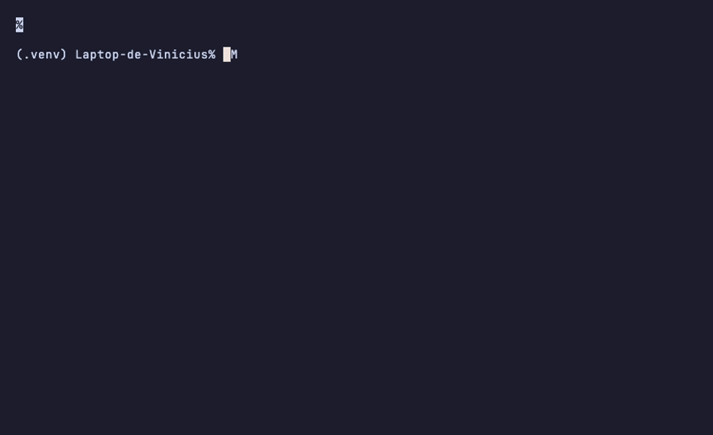

# Swift Code Reviewer Agent Skill

[](https://github.com/sponsors/Viniciuscarvalho)
[](https://www.npmjs.com/package/swift-code-reviewer-skill)

Multi-layer Swift/SwiftUI code review for Claude Code, OpenAI Codex CLI, Google Gemini CLI, and Kiro — with spec adherence, agent loop feedback, and project-standards validation.



---

## Quick Start

### 1. Install the skill (global, once)

```bash
npx skills add Viniciuscarvalho/swift-code-reviewer-skill
```

### 2. Scaffold the review agent into your project

```bash
cd ~/Projects/YourApp
npx swift-code-reviewer-skill init
```

The interactive prompt lets you choose which agent(s) to install:

```
? Which agent(s) should the review guide be installed for?
 ◉ Claude Code  (.claude/agents/ + .claude/commands/)
 ○ OpenAI Codex CLI  (swift-code-reviewer.md at repo root)
 ○ Google Gemini CLI  (swift-code-reviewer.md + .gemini/commands/review.toml)
 ○ Kiro  (.kiro/steering/swift-code-reviewer.md, fileMatch: **/*.swift)
```

#### CI / scripted install (no prompt)

```bash
npx swift-code-reviewer-skill init --agent claude          # Claude only (default in non-TTY)
npx swift-code-reviewer-skill init --all                   # all agents at once
npx swift-code-reviewer-skill init --agent codex,gemini    # specific subset
npx swift-code-reviewer-skill init --dry-run               # preview without writing files
```

### 3. Run a review

```
/review                      # Claude: staged + unstaged Swift changes
@swift-code-reviewer         # Claude: invoke agent directly
```

For Gemini: `/review` (via `.gemini/commands/review.toml`).
For Codex and Kiro: ask the agent to review your Swift changes directly.

---

## Choose Your Agent

| Agent           | Install target                          | `/review` command | Auto-activates  | Project standards file                |
| --------------- | --------------------------------------- | :---------------: | :-------------: | ------------------------------------- |
| **Claude Code** | `.claude/agents/swift-code-reviewer.md` |        ✅         |        —        | `.claude/CLAUDE.md`                   |
| **Codex CLI**   | `swift-code-reviewer.md` (root)         |        ❌         |        —        | `AGENTS.md`                           |
| **Gemini CLI**  | `swift-code-reviewer.md` (root)         |        ✅         |        —        | `GEMINI.md`                           |
| **Kiro**        | `.kiro/steering/swift-code-reviewer.md` |         —         | ✅ `**/*.swift` | `.kiro/steering/project-standards.md` |

---

## Capability Matrix

| Feature                         | Claude  |   Codex    |   Gemini   |    Kiro    |
| ------------------------------- | :-----: | :--------: | :--------: | :--------: |
| Phase 0 — Spec adherence        |   ✅    |     ✅     |     ✅     |     ✅     |
| Phase 1 — Swift quality         |   ✅    |     ✅     |     ✅     |     ✅     |
| Phase 2 — SwiftUI patterns      |   ✅    |     ✅     |     ✅     |     ✅     |
| Phase 3 — Performance           |   ✅    |     ✅     |     ✅     |     ✅     |
| Phase 4 — Security              |   ✅    |     ✅     |     ✅     |     ✅     |
| Phase 5 — Architecture          |   ✅    |     ✅     |     ✅     |     ✅     |
| Phase 6 — Project standards     |   ✅    |     ✅     |     ✅     |     ✅     |
| Phase 2.5 — Agent loop feedback |   ✅    |     ✅     |     ✅     |     ✅     |
| Companion skill cross-refs      | ✅ full | ⚡ inlined | ⚡ inlined | ⚡ inlined |
| `/review` slash command         |   ✅    |     ❌     |     ✅     |     —      |
| Auto-activates on Swift files   |    —    |     —      |     —      |     ✅     |

---

## Highlights

- **Seven-layer analysis** — spec adherence, Swift 6+ concurrency, SwiftUI patterns, performance, security, architecture, and project standards
- **Agent loop feedback** — detects recurring patterns and drafts `.claude/CLAUDE.md` rules to prevent them in future AI-generated code
- **Spec-first** — validates every acceptance criterion in the PR description against the actual diff; flags scope creep and missing implementations
- **Project-aware** — reads your project's standards file (`.claude/CLAUDE.md`, `AGENTS.md`, or `GEMINI.md`) and flags violations
- **Four agents, one install** — interactive `init` scaffolds the right files for each agent with idempotent, non-destructive writes

---

## How It Works

```
Phase 1  Context Gathering
  → gh pr view / glab mr view + git diff + project standards file

Phase 2  Analysis (per category)
  0. Spec Adherence     — requirement coverage table, scope creep, missing work
  1. Swift Quality      — concurrency, optionals, typed throws, naming
  2. SwiftUI Patterns   — @Observable, NavigationStack, .task, accessibility
  3. Performance        — ForEach identity, Equatable, lazy loading, GeometryReader
  4. Security           — Keychain, HTTPS, no secrets in logs
  5. Architecture       — MVVM/TCA, DI, testability
  6. Project Standards  — custom rules from your project standards file

Phase 2.5  Pattern Detection
  → group findings by rule; flag any rule firing ≥2 times as a recurring pattern
  → draft directives for your project standards file to prevent recurrence

Phase 3  Report
  → grouped by file, sorted by severity (Critical → High → Medium → Low)
  → prioritized action items + agent loop feedback
```

---

## Example Output

The following is a representative excerpt from `examples/claude-tca-review.md`, generated
against [pointfreeco/swift-composable-architecture](https://github.com/pointfreeco/swift-composable-architecture)
at commit [`d9f965e`](https://github.com/pointfreeco/swift-composable-architecture/commit/d9f965e38a86c78279ff59dfab1754b637f097a2).

```markdown
# Code Review — FeatureReducer.swift, FeatureView.swift

## Summary

Files: 2 | Critical: 0 | High: 2 | Medium: 1 | Low: 1

## Spec Adherence

**Source**: inferred from diff

| Requirement                         | Status                                      | Location                |
| ----------------------------------- | ------------------------------------------- | ----------------------- |
| State mutations isolated to Reducer | ✅ Implemented                              | FeatureReducer.swift:34 |
| View reads only from store          | ⚠️ Partial — direct URLSession call in body | FeatureView.swift:78    |

---

## FeatureView.swift

High **SwiftUI Patterns** (line 78)
Current: `URLSession.shared.dataTask(with: url) { ... }.resume()`
Fix: Move network call into the Reducer's Effect. Views in TCA must be
pure transformations of State — side effects belong in Effects returned
by the Reducer, not in the view body.

High **SwiftUI Patterns** (line 12)
Current: `NavigationView { ... }`
Fix: Replace with `NavigationStack`. NavigationView is deprecated as of iOS 16.

## Positive Observations

FeatureReducer.swift correctly uses typed throws and @Sendable closures throughout.

## Prioritized Action Items

- [Must fix] Move URLSession call from view body into Reducer Effect (FeatureView.swift:78)
- [Should fix] Replace NavigationView with NavigationStack (FeatureView.swift:12)
- [Consider] Add Equatable conformance to FeatureView for diffing (FeatureView.swift:1)

---

## Agent Loop Feedback

### Pattern: NavigationView (2 occurrences)

**Files**: FeatureView.swift:12, SettingsView.swift:44
**Suggested rule for .claude/CLAUDE.md**:

> Use `NavigationStack` exclusively. `NavigationView` is deprecated as of iOS 16.
```

See [`examples/`](examples/) for three full review reports against real OSS projects.

---

## Installation

### Primary (recommended)

```bash
npx skills add Viniciuscarvalho/swift-code-reviewer-skill
npx swift-code-reviewer-skill init
```

### NPX installer (skill only, no `init`)

```bash
npx swift-code-reviewer-skill
```

### Clone (for offline or development use)

```bash
git clone https://github.com/Viniciuscarvalho/swift-code-reviewer-skill.git \
  ~/.claude/skills/swift-code-reviewer-skill
```

### Update

```bash
npx swift-code-reviewer-skill@latest
```

### Uninstall

```bash
npx swift-code-reviewer-skill uninstall
```

---

## CLI Reference

```
npx swift-code-reviewer-skill [command] [options]

Commands:
  (none)     Install the skill to ~/.claude/skills/
  init       Scaffold review agent into the current project
  uninstall  Remove the skill from ~/.claude/skills/
  help       Show help

Options for init:
  --agent <name[,name]>   Target specific agent(s): claude, codex, gemini, kiro
  --all                   Install for all supported agents
  --force                 Overwrite existing files
  --dry-run               Preview writes without touching the filesystem
```

---

## Configuration

The skill validates your code against a project-specific standards file. The file path differs by agent:

| Agent       | Standards file                        |
| ----------- | ------------------------------------- |
| Claude Code | `.claude/CLAUDE.md`                   |
| Codex CLI   | `AGENTS.md`                           |
| Gemini CLI  | `GEMINI.md`                           |
| Kiro        | `.kiro/steering/project-standards.md` |

The file is optional — if absent, the skill falls back to Apple's official Swift API Design Guidelines.

**Example `.claude/CLAUDE.md`:**

```markdown
# MyApp Standards

## Architecture

- ViewModels MUST use @Observable (iOS 17+)
- All dependencies MUST be injected via constructor
- Views MUST NOT contain business logic

## Design System

- Use AppColors enum ONLY
- Use AppFonts enum ONLY

## Testing

- Minimum coverage: 80%
- All ViewModels MUST have unit tests
```

---

## Companion Skills (Claude)

When installed via `npx skills add`, Claude can read supplementary reference files from the
bundled companion skills for deeper context on specific topics:

```
skills/
├── README.md                    ← full index + attribution
├── swiftui-expert-skill/        ← SwiftUI state, Liquid Glass, macOS patterns
├── swift-concurrency/           ← actors, Sendable, Swift 6 migration
├── swift-testing/               ← Swift Testing framework, doubles, snapshots
├── swift-expert/                ← Swift 6+ specialist: protocols, memory, architecture
└── swiftui-ui-patterns/         ← 32 component references (nav, sheets, grids…)
```

For Codex, Gemini, and Kiro, the must-load excerpts from these skills are inlined directly
into the respective wrapper templates — no separate install step needed.

### Thanks to the original authors

| Author              | GitHub                                     |
| ------------------- | ------------------------------------------ |
| Antoine van der Lee | [@AvdLee](https://github.com/AvdLee)       |
| Thomas Ricouard     | [@Dimillian](https://github.com/Dimillian) |
| Eduardo Bocato      | [@bocato](https://github.com/bocato)       |

Each skill folder contains a `NOTICE.md` with attribution details. If you are an original
author and want attribution updated or content removed, please
[open an issue](https://github.com/Viniciuscarvalho/swift-code-reviewer-skill/issues).

---

## Per-Agent Quirks & Limitations

### Claude Code

- Full companion-skill cross-references resolve automatically from `~/.claude/skills/swift-*/`
- `/review` slash command available after `init`

### OpenAI Codex CLI

- No `/review` slash command — Codex CLI does not support custom slash commands
- `@`-path mentions in `AGENTS.md` are **not** auto-resolved; Codex concatenates `AGENTS.md`
  verbatim into the system prompt. After `init`, paste this into your `AGENTS.md` manually:

  ```markdown
  ## Swift code review

  See swift-code-reviewer.md for the full review guide.
  ```

- Companion skill excerpts are inlined into `swift-code-reviewer.md`; no external files needed

### Google Gemini CLI

- `/review` available via `.gemini/commands/review.toml` — the TOML `prompt` field uses
  `@./swift-code-reviewer.md` which Gemini **does** resolve at command invocation time
- Companion skill excerpts are inlined; no external files needed

### Kiro

- Steering is workspace-scoped (`inclusion: fileMatch`, `fileMatchPattern: "**/*.swift"`) —
  the guide activates automatically whenever you open or edit a Swift file
- **Known bug**: Kiro global steering has a bug
  ([kirodotdev/Kiro#6171](https://github.com/kirodotdev/Kiro/issues/6171)) — workspace-scoped
  steering is the recommended path until it is resolved
- No dedicated slash command — ask Kiro directly to review your Swift changes

---

## Project Layout

```
swift-code-reviewer-skill/
├── core/
│   └── swift-code-reviewer.core.md  ← canonical agent-agnostic source of truth
├── templates/
│   ├── agents/
│   │   ├── claude/swift-code-reviewer.md
│   │   ├── codex/swift-code-reviewer.md
│   │   ├── gemini/swift-code-reviewer.md
│   │   └── kiro/swift-code-reviewer.md
│   └── commands/
│       ├── claude/review.md
│       └── gemini/review.toml
├── references/                       ← detailed review checklists (agent-agnostic)
│   ├── review-workflow.md
│   ├── swift-quality-checklist.md
│   ├── swiftui-review-checklist.md
│   ├── performance-review.md
│   ├── security-checklist.md
│   ├── architecture-patterns.md
│   ├── feedback-templates.md
│   ├── spec-adherence.md
│   ├── agent-loop-feedback.md
│   └── custom-guidelines.md
├── skills/                           ← bundled companion skills
├── examples/                         ← real review reports (3 OSS projects)
├── assets/
│   ├── demo.png
│   └── init-demo.tape                ← VHS script for init-demo.gif
├── bin/
│   ├── install.js                    ← CLI entry point
│   └── lib/
│       ├── agents.js                 ← per-agent install functions
│       └── prompt.js                 ← TTY-aware agent selector
├── __tests__/
│   └── installer.test.js
└── SKILL.md                          ← Claude Code skill descriptor
```

---

## Development

```bash
git clone https://github.com/Viniciuscarvalho/swift-code-reviewer-skill.git
cd swift-code-reviewer-skill
npm install

# Run installer tests
node --test __tests__/installer.test.js

# Preview init in a sandbox
cd "$(mktemp -d)" && git init
node /path/to/swift-code-reviewer-skill/bin/install.js init --dry-run
node /path/to/swift-code-reviewer-skill/bin/install.js init --all
node /path/to/swift-code-reviewer-skill/bin/install.js init  # interactive

# Regenerate the demo GIF (requires vhs)
brew install vhs
vhs /path/to/swift-code-reviewer-skill/assets/init-demo.tape
```

---

## Contributing

See [CONTRIBUTING.md](CONTRIBUTING.md) for the full guide, including the
[**Adding a new agent target**](CONTRIBUTING.md#adding-a-new-agent-target) checklist.

1. Edit `SKILL.md` or `core/swift-code-reviewer.core.md` for review logic
2. Update `references/` for specific checklists
3. Add/modify per-agent templates in `templates/`
4. Add tests in `__tests__/installer.test.js`
5. Submit a pull request

---

## License

MIT — see [LICENSE](LICENSE).

---

**Made with care for the Swift community**

[Issues](https://github.com/Viniciuscarvalho/swift-code-reviewer-skill/issues) · [Discussions](https://github.com/Viniciuscarvalho/swift-code-reviewer-skill/discussions) · [Sponsor](https://github.com/sponsors/Viniciuscarvalho)
