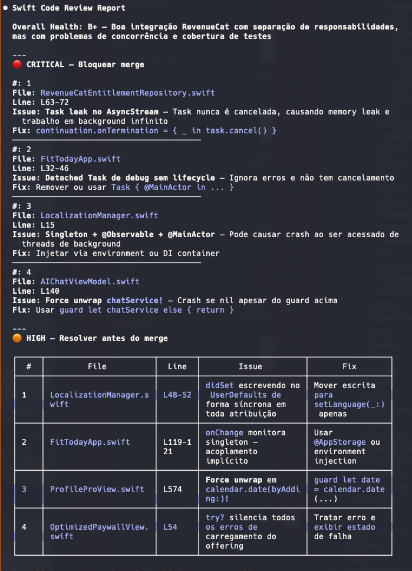

# Swift Code Reviewer Agent Skill

[](https://github.com/sponsors/Viniciuscarvalho)
[](https://www.npmjs.com/package/swift-code-reviewer-skill)

A code review skill for [Claude Code](https://docs.anthropic.com/en/docs/claude-code) that performs multi-layer analysis of Swift and SwiftUI code, combining Apple's best practices with your project-specific coding standards.

## Quick Start

```bash
npx swift-code-reviewer-skill
```

That's it. The skill is installed and ready to use. Run it again anytime to update to the latest version.

> No cloning, no manual setup. NPX always fetches the latest version automatically.

## Usage



Just ask Claude to review your code:

```
Review this PR
Review LoginView.swift
Review my uncommitted changes
Review all ViewModels in the Features folder
Check if this follows our coding standards
```

The skill automatically activates, reads your `.claude/CLAUDE.md` for project standards, and generates a structured report with severity levels, code examples, and prioritized action items.

### Example Output

```markdown
# Code Review Report

## Summary

- Files Reviewed: 3 | Critical: 0 | High: 1 | Medium: 2 | Low: 1

## File: LoginViewModel.swift

✅ **Excellent Modern API Usage** (line 12)

- Using @Observable instead of ObservableObject

🟡 **Force Unwrap Detected** (line 89)
Current: `let user = repository.currentUser!`
Fix:
guard let user = repository.currentUser else {
logger.error("No current user")
return
}

🔴 **Violates Design System Standard** (line 45)
Current: `.foregroundColor(.blue)`
Fix: `.foregroundColor(AppColors.primary)`

## Prioritized Action Items

1. [Must fix] Remove force unwrap at line 89
2. [Should fix] Use design system colors at line 45
```

## What It Reviews

| Category              | Checks                                                                                                    |
| --------------------- | --------------------------------------------------------------------------------------------------------- |
| **Swift Quality**     | Concurrency safety, actor isolation, Sendable, error handling, optionals, access control, naming          |
| **SwiftUI Patterns**  | @Observable, state management, property wrappers, NavigationStack, .task, view composition, accessibility |
| **Performance**       | View updates, Equatable, ForEach identity, GeometryReader, lazy loading, memory leaks                     |
| **Security**          | Keychain, input validation, HTTPS, certificate pinning, API key protection, sensitive data logging        |
| **Architecture**      | MVVM/MVI/TCA compliance, dependency injection, code organization, testability                             |
| **Project Standards** | `.claude/CLAUDE.md` rules, design system, custom error patterns, testing requirements                     |

### Severity Levels

| Icon | Severity | Action                  |
| ---- | -------- | ----------------------- |
| 🔴   | Critical | Must fix before merge   |
| 🟡   | High     | Should fix before merge |
| 🟠   | Medium   | Fix in current sprint   |
| 🔵   | Low      | Consider for future     |

## Platform Support

- Works with **GitHub PRs** (`gh`), **GitLab MRs** (`glab`), and **local git changes**
- Swift 6.0+ | iOS 17+ | macOS 14+ | watchOS 10+ | tvOS 17+ | visionOS 1+

## Project-Specific Standards

Add a `.claude/CLAUDE.md` to your project and the skill will validate against your rules:

```markdown
# MyApp Standards

## Architecture

- ViewModels MUST use @Observable (iOS 17+)
- All dependencies MUST be injected via constructor
- Views MUST NOT contain business logic

## Design System

- Use AppColors enum ONLY
- Use AppFonts enum ONLY

## Testing

- Minimum coverage: 80%
- All ViewModels MUST have unit tests
```

## Alternative Installation

<details>
<summary>Clone this repository</summary>

```bash
git clone https://github.com/Viniciuscarvalho/swift-code-reviewer-skill.git ~/.claude/skills/swift-code-reviewer-skill
```

</details>

<details>
<summary>Manual installation</summary>

```bash
mkdir -p ~/.claude/skills/swift-code-reviewer-skill/references
```

Download the files from this repository into the directory, then restart Claude.

</details>

<details>
<summary>Uninstall</summary>

```bash
npx swift-code-reviewer-skill uninstall
```

</details>

## Integration with Other Skills

This skill optionally leverages **swift-best-practices**, **swiftui-expert-skill**, and **swiftui-performance-audit** for deeper analysis. It works independently with its own comprehensive checklists.

## Contributing

1. Edit `SKILL.md` for main skill logic
2. Update reference files in `references/` for specific checklists
3. Test with real Swift/SwiftUI code
4. Submit a pull request

## License

MIT License - See [LICENSE](LICENSE) file for details.

---

**Made with ❤️ for the Swift community**

If this skill helps your code reviews, please star the repository!

- [Issues](https://github.com/Viniciuscarvalho/swift-code-reviewer-skill/issues) | [Discussions](https://github.com/Viniciuscarvalho/swift-code-reviewer-skill/discussions)
